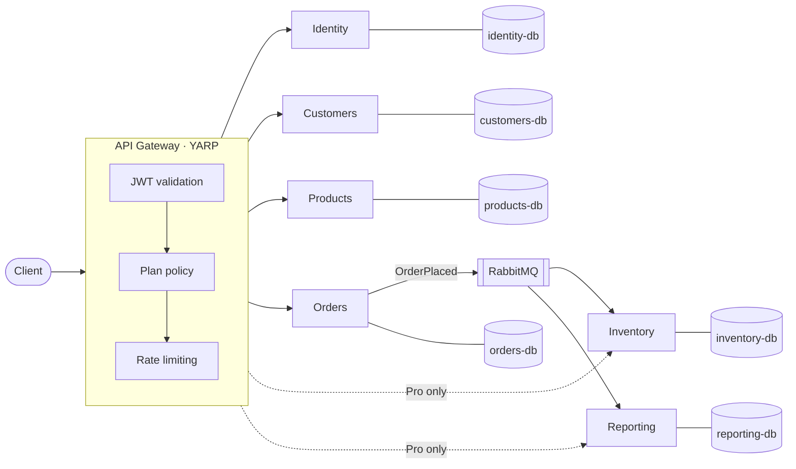

# MyWorkplace

**English** | [Türkçe](README.tr.md)

A multi-tenant SaaS for small business management with **Basic** and **Professional** plans,
built on .NET 10 with an API gateway and independent services.

> **This is a learning project.** Its purpose is to show how a senior engineer designs such a system —
> and how a project can be run with an AI coding assistant ([Claude Code](https://claude.com/claude-code))
> as a disciplined team member rather than a code generator.
> Every decision is written down with its reasons.


---

## What it does

Every company (tenant) signs up on a plan. The gateway decides which modules the company can reach.

| Module | Basic | Professional |
| --- | :---: | :---: |
| Customers | ✅ | ✅ |
| Products | ✅ | ✅ |
| Orders | ✅ | ✅ |
| Inventory | — | ✅ |
| Reporting | — | ✅ |

A company can upgrade from Basic to Professional at any time.

## Architecture



Key ideas:

- **One entry point.** All traffic goes through the gateway, which validates the token and enforces the plan.
  A Basic company calling a Pro module gets `403` before the request ever reaches the service.
- **Defense in depth.** Each service re-validates the token and the plan on its own.
- **Failure isolation.** Each service owns its database and services talk through events,
  so when Inventory is down, orders are still accepted and stock catches up later.
- **Tenant isolation.** Every query is automatically scoped to the caller's company.

Full reasoning, alternatives and trade-offs: [docs/architecture.md](docs/architecture.md).

## Tech stack

| Area | Choice |
| --- | --- |
| Runtime | .NET 10, ASP.NET Core Minimal APIs |
| Gateway | YARP |
| Orchestration & observability | .NET Aspire, OpenTelemetry |
| Database | PostgreSQL (one database per service), EF Core |
| Messaging | RabbitMQ (transactional outbox) |
| Auth | JWT (RS256) issued by our own Identity service, validated via JWKS |
| Tests | xUnit v3, Aspire integration testing |

## Getting started

### Prerequisites

- [.NET 10 SDK](https://dotnet.microsoft.com/download)
- [Aspire CLI](https://get.aspire.dev) — or run `dnx aspire.cli -- setup` once
- [Docker Desktop](https://www.docker.com/products/docker-desktop/) — needed from Sprint 1, when PostgreSQL arrives
- VS Code with the C# Dev Kit extension, or Visual Studio 2026

### Run

```bash
git clone <repository-url>
cd <repository-folder>
dotnet run --project src/MyWorkplace.AppHost
```

The Aspire dashboard opens in your browser and shows every service, its logs and traces.
Try the gateway: open the `gateway` endpoint from the dashboard and append `/customers/info`.

- **VS Code:** press **F5** (launch profile *MyWorkplace (Aspire AppHost)*).
- **Visual Studio:** open `MyWorkplace.slnx`, set `MyWorkplace.AppHost` as the startup project, press **F5**.

### Test

```bash
dotnet test --solution MyWorkplace.slnx
```

## How this project is built

The development process is part of what this repository demonstrates:

| File | Purpose |
| --- | --- |
| [CLAUDE.md](CLAUDE.md) | Rules for the AI assistant — its persistent memory between sessions |
| [docs/architecture.md](docs/architecture.md) | Architecture Decision Records: what we chose, why, and at what cost |
| [docs/tasks.md](docs/tasks.md) | Task board: sprints, acceptance criteria, progress |
| [docs/process/](docs/process/) | Workflow, task, Git and code conventions |

The human makes every architectural decision and approves every merge; the assistant proposes options,
implements, tests and explains.

## Roadmap

- [ ] **Sprint 0 — Foundation:** repository, solution skeleton, CI
- [ ] **Sprint 1 — MVP:** Identity, Gateway, Customers (Basic), Inventory (Pro), plan upgrade
- [ ] Products & Orders, event-driven stock updates, live resilience demo
- [ ] Reporting, per-plan rate limiting, refresh tokens
- [ ] User interface

Details: [docs/tasks.md](docs/tasks.md)

## License

[MIT](LICENSE)
