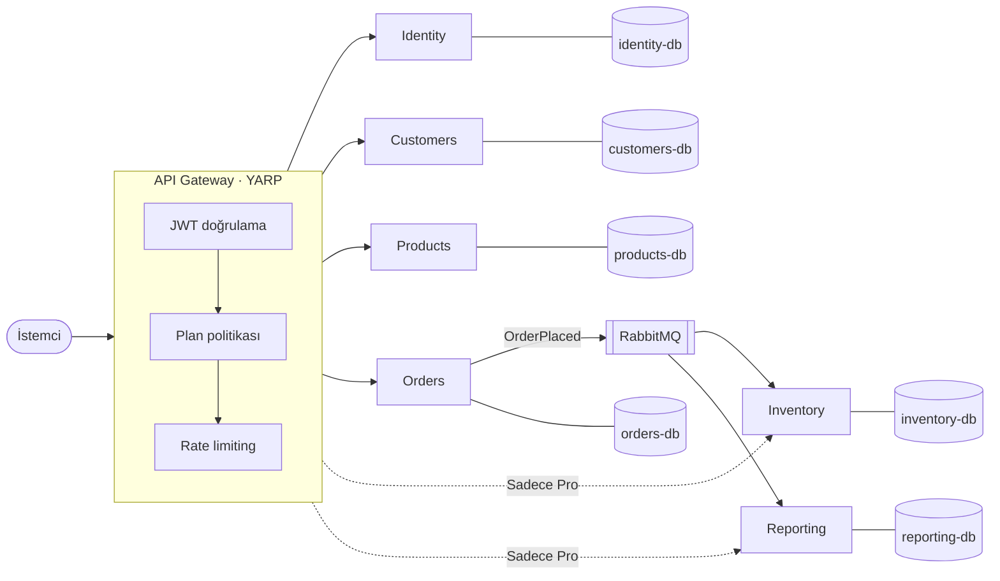

# MyWorkplace

[English](README.md) | **Türkçe**

Küçük işletmeler için **Basic** ve **Professional** planlı, çok kiracılı (multi-tenant) bir SaaS yönetim sistemi.
.NET 10 ile, bir API gateway ve bağımsız servislerle geliştirilmektedir.

> **Bu bir öğrenme projesidir.** Amacı, böyle bir sistemi bir senior mühendisin nasıl tasarladığını
> ve bir projenin yapay zeka kod asistanıyla ([Claude Code](https://claude.com/claude-code))
> nasıl yürütülebileceğini göstermektir. Burada asistan bir kod üreticisi değil, disiplinli bir ekip üyesi gibi çalışır.
> Her karar gerekçesiyle birlikte yazılıdır.

[](https://github.com/mehmetduranyilmaz/MyWorkPlace/actions/workflows/ci.yml)


---

## Ne yapar

Her firma (tenant) bir plana kaydolur. Firmanın hangi modüllere erişebileceğine gateway karar verir.

| Modül | Basic | Professional |
| --- | :---: | :---: |
| Müşteriler | ✅ | ✅ |
| Ürünler | ✅ | ✅ |
| Siparişler | ✅ | ✅ |
| Stok | — | ✅ |
| Raporlar | — | ✅ |

Bir firma istediği zaman Basic'ten Professional'a geçebilir.

## Mimari



Temel fikirler:

- **Tek giriş noktası.** Tüm trafik gateway'den geçer; gateway token'ı doğrular ve planı uygular.
  Pro modüle istek atan Basic bir firma, istek servise hiç ulaşmadan `403` alır.
- **Savunma derinliği.** Her servis token'ı ve planı kendisi de tekrar kontrol eder.
- **Hata izolasyonu.** Her servisin kendi veritabanı vardır ve servisler olaylarla haberleşir.
  Böylece Stok servisi kapalıyken bile sipariş alınır; stok, servis geri gelince güncellenir.
- **Firma izolasyonu.** Her sorgu otomatik olarak isteği yapan firmanın verisiyle sınırlanır.

Kararların tüm gerekçeleri, alternatifleri ve bedelleri: [docs/architecture.md](docs/architecture.md) (İngilizce).

## Teknolojiler

| Alan | Seçim |
| --- | --- |
| Çalışma ortamı | .NET 10, ASP.NET Core Minimal API |
| Gateway | YARP |
| Orkestrasyon ve izleme | .NET Aspire, OpenTelemetry |
| Veritabanı | PostgreSQL (her servise ayrı veritabanı), EF Core |
| Mesajlaşma | RabbitMQ (transactional outbox) |
| Kimlik | Kendi Identity servisimizin ürettiği JWT (RS256), JWKS ile doğrulama |
| Testler | xUnit v3, Testcontainers (gerçek PostgreSQL), Aspire entegrasyon testleri |

## Başlarken

### Gereksinimler

- [.NET 10 SDK](https://dotnet.microsoft.com/download)
- [Aspire CLI](https://get.aspire.dev) — veya bir kez `dnx aspire.cli -- setup` çalıştırın
- [Docker Desktop](https://www.docker.com/products/docker-desktop/) — sistem ve testler için PostgreSQL'i çalıştırır
- C# Dev Kit eklentili VS Code veya Visual Studio 2026

### Çalıştırma

```bash
git clone https://github.com/mehmetduranyilmaz/MyWorkPlace.git
cd MyWorkPlace
dotnet run --project src/MyWorkplace.AppHost
```

Aspire paneli tarayıcıda açılır; tüm servisleri, loglarını ve izlerini gösterir.
Panelden:

- **Kayıt olun ve giriş yapın:** `identity` adresini açın ve sonuna `/scalar` ekleyin — API referansı,
  `POST /identity/register` ve `POST /identity/login` çağrılarını tarayıcıdan yapmanızı sağlar. Dönen `accessToken`'ı
  [jwt.io](https://jwt.io) sitesine yapıştırarak içindeki claim'leri görün. Gateway üzerinden adresler `<gateway>/identity/` ile başlar.
- **Müşterileri yönetin:** token'ı `Authorization: Bearer <token>` olarak göndererek `POST <gateway>/customers` çağırın,
  sonra `<gateway>/customers/{id}` üzerinde `GET`, `PUT` (okuduğunuz `ETag`'i `If-Match` olarak gönderin) ve `DELETE` deneyin.
  `customers` adresinin `/scalar` sayfası tüm durum kodlarını anlatır.
- **Veritabanını inceleyin:** `postgres` yanındaki **PgWeb**'i açarak `tenants`, `users` ve `audit_log` tablolarını görün.

- **VS Code:** **F5** tuşuna basın (*MyWorkplace (Aspire AppHost)* profili).
- **Visual Studio:** `MyWorkplace.slnx` dosyasını açın, `MyWorkplace.AppHost` projesini başlangıç projesi yapın, **F5** tuşuna basın.

### Test

```bash
dotnet test --solution MyWorkplace.slnx
```

## Bu proje nasıl geliştiriliyor

Geliştirme süreci de bu deponun gösterdiği şeylerden biridir:

| Dosya | Amacı |
| --- | --- |
| [CLAUDE.md](CLAUDE.md) | Yapay zeka asistanının kuralları; oturumlar arasındaki kalıcı hafızası |
| [docs/architecture.md](docs/architecture.md) | Mimari karar kayıtları (ADR): neyi seçtik, neden, hangi bedelle |
| [docs/tasks.md](docs/tasks.md) | Görev panosu: sprintler, kabul kriterleri, ilerleme |
| [docs/process/](docs/process/) | Çalışma akışı, görev, Git ve kod kuralları |

Her mimari kararı insan verir ve her merge'ü insan onaylar. Asistan seçenekleri sunar, uygular, test eder ve açıklar.

## Yol haritası

- [x] **Sprint 0 — Altyapı:** depo, çözüm iskeleti, CI
- [x] **Sprint 1 — MVP:** Identity, Gateway, Customers (Basic), Inventory (Pro), plan yükseltme
- [ ] **Sprint 2 — Tak-çalıştır çekirdek:** roller ve izinler, outbox'lı mesajlaşma, modül rehberi —
      çekirdek koda dokunmadan Products eklenerek kanıtlanır
- [ ] Orders, olay tabanlı stok güncelleme, canlı dayanıklılık demosu
- [ ] Raporlama, plana göre rate limiting, refresh token
- [ ] Kullanıcı arayüzü

Ayrıntılar: [docs/tasks.md](docs/tasks.md) (İngilizce)

## Lisans

[MIT](LICENSE)
